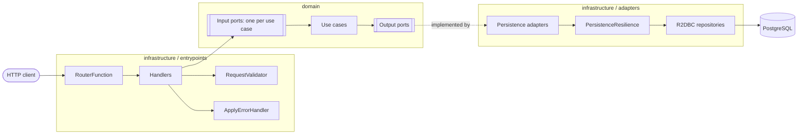
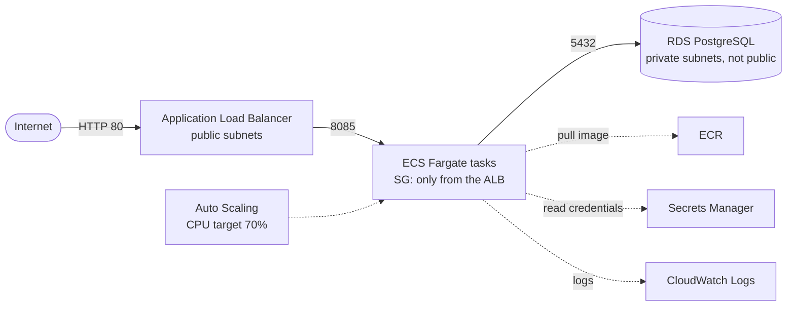

# Franchise API

Reactive REST API to manage a network of franchises, their branches and the products each branch sells.
Built end to end without blocking calls: Spring WebFlux functional endpoints, R2DBC with PostgreSQL and
Resilience4j, following a hexagonal (ports and adapters) architecture.

- **Franchise**: name and a list of branches
- **Branch**: name and a list of products
- **Product**: name and stock

## Table of contents

1. [Tech stack](#tech-stack)
2. [Architecture](#architecture)
3. [Endpoints](#endpoints)
4. [Run locally](#run-locally)
5. [Configuration](#configuration)
6. [Tests and coverage](#tests-and-coverage)
7. [Error handling](#error-handling)
8. [Resilience](#resilience)
9. [Deployment on AWS](#deployment-on-aws)

## Tech stack

| Concern | Choice |
|---|---|
| Language | Java 17 |
| Framework | Spring Boot 3.5, Spring WebFlux (RouterFunction + handlers) |
| Persistence | Spring Data R2DBC + PostgreSQL |
| Resilience | Resilience4j circuit breaker, Reactor timeout, retry with backoff |
| Validation | Jakarta Bean Validation |
| Mapping | MapStruct, Lombok |
| API docs | springdoc-openapi (OpenAPI 3 + Swagger UI) |
| Tests | JUnit 5, Mockito, Reactor StepVerifier, WebTestClient, JaCoCo |
| Containers | Docker multi-stage build, Docker Compose |

## Architecture

The code is split in three layers. Dependencies always point to the domain, and the domain does not import
Spring or any other framework.



```
src/main/java/com/franchise/project
├── application/config        Spring wiring: one @Bean per use case and adapter
├── domain                    Framework-free business core
│   ├── <aggregate>/api       Input ports (one interface per use case)
│   ├── <aggregate>/spi       Output ports (persistence contracts)
│   ├── <aggregate>/usecase   Business rules
│   ├── <aggregate>/model     Entities
│   └── exception, enums, util
└── infrastructure
    ├── entrypoints           Routers, handlers, request/response records, error mapping
    └── adapters              R2DBC entities, repositories, adapters and resilience
```

Business rules:

- Franchise names are unique. Branch names are unique within their franchise and product names are unique
  within their branch (also enforced by database constraints).
- Stock must be greater than or equal to zero.
- Deleting a product removes it permanently.

## Endpoints

Base URL when running locally: `http://localhost:8085`

| # | Operation | Method | Path |
|---|---|---|---|
| 1 | Create a franchise | `POST` | `/api/v1/franchise` |
| 2 | Add a branch to a franchise | `POST` | `/api/v1/branch` |
| 3 | Add a product to a branch | `POST` | `/api/v1/product` |
| 4 | Delete a product from its branch | `DELETE` | `/api/v1/product/{productId}` |
| 5 | Update the stock of a product | `PUT` | `/api/v1/product/stock` |
| 6 | Largest stock product of each branch of a franchise | `GET` | `/api/v1/franchise/{franchiseId}/top-stock-products` |
| 7 | Update the name of a franchise | `PUT` | `/api/v1/franchise/name` |
| 8 | Update the name of a branch | `PUT` | `/api/v1/branch/name` |
| 9 | Update the name of a product | `PUT` | `/api/v1/product/name` |

Interactive documentation with request/response examples and every error code:

- Swagger UI: `http://localhost:8085/webjars/swagger-ui/index.html`
- OpenAPI JSON: `http://localhost:8085/v3/api-docs`

Example flow:

```bash
curl -X POST localhost:8085/api/v1/franchise -H "Content-Type: application/json" -d '{"name":"Coffee House"}'
curl -X POST localhost:8085/api/v1/branch -H "Content-Type: application/json" -d '{"name":"Downtown","franchiseId":1}'
curl -X POST localhost:8085/api/v1/product -H "Content-Type: application/json" -d '{"name":"Espresso","stock":25,"branchId":1}'
curl -X PUT localhost:8085/api/v1/product/stock -H "Content-Type: application/json" -d '{"id":1,"stock":40}'
curl localhost:8085/api/v1/franchise/1/top-stock-products
curl -X DELETE localhost:8085/api/v1/product/1
```

## Run locally

### Prerequisites

| Tool | Version | Needed for |
|---|---|---|
| Docker + Docker Compose | Docker 24+ | Running the database and the API |
| Java (JDK) | 17 | Running the API or the tests outside Docker |
| AWS CLI and Terraform | AWS CLI 2, Terraform 1.10+ | Only for the AWS deployment |

Gradle does not need to be installed: the project ships with the Gradle wrapper.

### Option A: everything with Docker Compose

```bash
cp .env.example .env            # then set a password in .env
docker compose up --build
```

Compose starts PostgreSQL, waits for it to be healthy, builds the API image and starts it. The schema in
`src/main/resources/schema.sql` is applied on startup (`SPRING_SQL_INIT_MODE=always`).

Check that it is up:

```bash
curl localhost:8085/actuator/health      # {"status":"UP"}
```

Stop it with `docker compose down` (add `-v` to also delete the database volume).

### Option B: database in Docker, API from the IDE or Gradle

```bash
cp .env.example .env
docker compose up -d postgres
export $(grep -v '^#' .env | xargs)      # Windows PowerShell: set the SPRING_R2DBC_* variables manually
SPRING_SQL_INIT_MODE=always ./gradlew bootRun
```

## Configuration

All settings come from environment variables. Defaults are only meant for local development.

| Variable | Default | Description |
|---|---|---|
| `SPRING_R2DBC_URL` | `r2dbc:postgresql://localhost:5432/franchise` | Database URL (add `?sslmode=require` for managed databases) |
| `SPRING_R2DBC_USERNAME` | `franchise` | Database user |
| `SPRING_R2DBC_PASSWORD` | `change-me` | Database password |
| `SPRING_SQL_INIT_MODE` | `never` | `always` applies `schema.sql` on startup |
| `POSTGRES_DB`, `POSTGRES_USER`, `POSTGRES_PASSWORD` | see `.env.example` | Used by Docker Compose for the database container |

Resilience thresholds live in `application.yml` under `resilience4j` and `persistence.resilience`.
`.env` and `*.tfvars` are ignored by Git; only the `*.example` files are versioned.

## Tests and coverage

```bash
./gradlew test                    # run the test suite
./gradlew check                   # tests + JaCoCo report + 70% line coverage verification
```

The coverage report is generated at `build/reports/jacoco/test/html/index.html`.
Lombok-generated code and MapStruct implementations are excluded from the coverage figures.

What is covered:

- **Use cases**: one test class per use case with the real `ValidationCondition`, covering the happy path and
  business errors (not found, duplicated name, negative stock) with `StepVerifier`.
- **Handlers**: real router, validator, mappers and error handler through `WebTestClient`, asserting
  200/201/400/404/409/500/503.
- **Resilience**: retry with backoff, no retry for writes, timeout and circuit opening using virtual time.
- **Application**: context startup, OpenAPI contract of the nine endpoints and Actuator exposure.

## Error handling

Errors are resolved inside the reactive chain with `onErrorResume`, one branch per exception type, and always
return the same body shape:

```json
{"code":"404","message":"The franchise does not exist","date":"2026-01-01T12:00:00Z",
 "errors":[{"code":"404","message":"The franchise does not exist"}]}
```

| Status | When |
|---|---|
| 400 | Missing or blank fields, non numeric identifiers, negative stock, malformed JSON |
| 404 | The franchise, branch or product does not exist |
| 409 | Duplicated name in the same scope |
| 500 | Unexpected error (no internal details are returned) |
| 503 | Database timeout or circuit breaker open |

## Resilience

Every persistence call goes through `PersistenceResilience`:

1. **Timeout** (`2s`) on each attempt.
2. **Circuit breaker** (Resilience4j): opens when 50% of the last 20 calls fail (minimum 10), stays open
   10 seconds and allows 3 trial calls in half-open state.
3. **Retry with exponential backoff** (2 retries starting at 200 ms) only for reads, because they are
   idempotent, and only for transient errors or timeouts.
4. **Backpressure**: read ports return `Flux` straight from R2DBC and `limitRate` bounds the demand sent to
   the driver, so results are never fully loaded in memory.

## Deployment on AWS

The whole infrastructure is defined with Terraform (`terraform/`) and is designed to run a short-lived
environment for a few cents a day.



### Layout

```
terraform/
├── bootstrap/          S3 bucket for the remote state (native locking) and a monthly budget alert
├── modules/
│   ├── networking/     VPC, public and private subnets in 2 AZs, optional NAT gateway
│   ├── security/       Security groups: Internet → ALB → ECS → RDS
│   ├── ecr/            Image repository with immutable tags, scan on push and lifecycle policy
│   ├── database/       RDS PostgreSQL in private subnets, password managed by RDS in Secrets Manager
│   ├── iam/            Least privilege task execution role
│   ├── alb/            Load balancer, target group and health check on /actuator/health
│   ├── ecs/            Cluster, task definition, service and log group
│   └── autoscaling/    Target tracking policy on CPU
├── environments/
│   ├── dev/            backend.hcl.example and terraform.tfvars.example
│   └── prod/           Same stack with bigger sizes, NAT gateway and Multi-AZ database
└── main.tf             Root stack shared by every environment
```

Every environment uses the same root stack with its own variables file and its own state key, so no resource
is duplicated between environments.

### Cost

The `dev` values keep the bill to roughly **USD 1.5–2 per day** (often covered by the AWS free tier or
credits): no NAT gateway, one 0.25 vCPU task, a `db.t4g.micro` Single-AZ database without backups and one
day of log retention. The tasks run in public subnets but their security group only accepts traffic from the
load balancer; the database is always private. Destroy the environment after using it.

### Prerequisites

- AWS account and the AWS CLI configured (`aws configure`) with permissions to create the resources above
- Terraform 1.10 or newer
- Docker

### 1. Bootstrap the remote state (once per account)

```bash
cd terraform/bootstrap
cp terraform.tfvars.example terraform.tfvars        # set budget_alert_email
terraform init
terraform apply
```

Confirm the subscription email sent by AWS Budgets. Note the `state_bucket_name` output.

### 2. Configure the environment

```bash
cd ..                                                # terraform/
cp environments/dev/backend.hcl.example environments/dev/backend.hcl
cp environments/dev/terraform.tfvars.example environments/dev/terraform.tfvars
```

Set the bucket name from step 1 in `backend.hcl`. Both files are ignored by Git.

```bash
terraform init -backend-config=environments/dev/backend.hcl
```

### 3. Create the image repository and push the image

The ECS service needs an image before it can start, so the repository is created first.

```bash
export IMAGE_TAG=$(git rev-parse --short HEAD)
terraform apply -var-file=environments/dev/terraform.tfvars -var image_tag=$IMAGE_TAG -target=module.ecr

export ECR_URL=$(terraform output -raw ecr_repository_url)
aws ecr get-login-password --region us-east-1 | docker login --username AWS --password-stdin ${ECR_URL%%/*}
docker build -t $ECR_URL:$IMAGE_TAG ..
docker push $ECR_URL:$IMAGE_TAG
```

Image tags are immutable: every deployment uses the commit hash, never `latest`.

### 4. Deploy the environment

```bash
terraform plan  -var-file=environments/dev/terraform.tfvars -var image_tag=$IMAGE_TAG
terraform apply -var-file=environments/dev/terraform.tfvars -var image_tag=$IMAGE_TAG
```

The database takes around 5–10 minutes to be created. The schema is applied by the application on startup.

### 5. Verify

```bash
export API_URL=$(terraform output -raw api_url)
curl $API_URL/actuator/health
curl -X POST $API_URL/api/v1/franchise -H "Content-Type: application/json" -d '{"name":"Coffee House"}'
terraform output swagger_url
```

Logs are available in CloudWatch under `/ecs/franchise-dev`.

### 6. Deploy a new version

Build and push a new image with the new commit hash (step 3 without the `-target` apply) and run step 4 with
the new `IMAGE_TAG`. The deployment circuit breaker rolls back automatically if the new tasks never become
healthy.

### 7. Destroy everything

```bash
terraform destroy -var-file=environments/dev/terraform.tfvars -var image_tag=$IMAGE_TAG
cd bootstrap && terraform destroy                    # optional: removes the state bucket and the budget
```

To work with `prod`, run `terraform init -reconfigure -backend-config=environments/prod/backend.hcl` and use
the `prod` variables file.

**Deployed URL:** pending (filled in after the deployment for the presentation).
